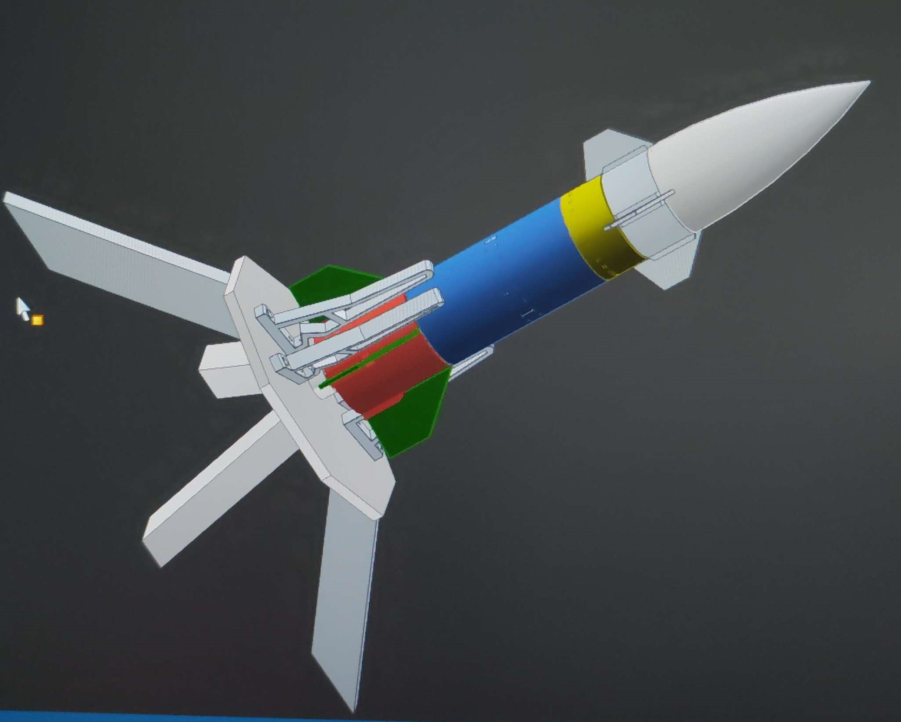

# Neptune 1 - is a Water.Rocket 3D printed and written in Micropython  
## -> uses inovated water fuel for eco-friendly space boosts
## Requirements specification:
- [Neptune 1 - is a Water.Rocket 3D printed and written in Micropython](#neptune-1---is-a-waterrocket-3d-printed-and-written-in-micropython)
  - [-\> uses inovated water fuel for eco-friendly space boosts](#--uses-inovated-water-fuel-for-eco-friendly-space-boosts)
  - [Requirements specification:](#requirements-specification)
  - [1. overview](#1-overview)
  - [2. water.rocket](#2-waterrocket)
  - [3. flight controller](#3-flight-controller)
  - [4. software from flight controller](#4-software-from-flight-controller)
  - [5. rocket.base](#5-rocketbase)
  - [6. detailed trigger and parachute system](#6-detailed-trigger-and-parachute-system)
  - [7. rocketscience and future builds](#7-rocketscience-and-future-builds)

{width=150px height=150px}

## 1. overview
The Water.Rocket is a 3D printed project. You will need:
- a 3D printer
- some Filaments
- empty Water Bottle (small)
- empty Water Bottle (hard plastic)
- some sealing rings
- car ventil
- some screws
- Wood (for the Rocket Base)
- NodeMCU
- 18260 Battery
- ADXL345
- neopixel LED
- servo
- wrapping wire
- plastic foil
- Cord
- superglue
- cable ties
**All together WITHOUT 3D printing, arround 40 $**

This the mp-remote commands for the NodeMcu board:  
- this command upload the main.py to the micropython board over com11  
`python.exe -m mpremote connect com6 cp main.py :`  
- this command connects to the python prompt over com11  
`python.exe -m mpremote connect com6`  

## 2. water.rocket
There are serveral Parts from the rocket.
- empty Water Bottle (hard plastic)
CAD Parts 3D printed:
Explosion view of the rocket:

## 3. flight controller
Parts:
- NodeMCU
- 18260 Battery
- on/off switch
- neopixel LED
- ADXL345
- Servo

Wiring-plan:

## 4. software from flight controller

I coded the software in micropython. Main-programm is short, standard libraries for the neopixel and the adxl345

## 5. rocket.base
the rocket base is mixxed build from wood and 3d printing parts.
For put the pressed air in the bottle, i use a bicycle wheel value and some sealing rings.
The trigger is build from 3D printed, wrapping wiring and cable ties.

Explosion view of the rocket base:

## 6. detailed trigger and parachute system  
  

## 7. rocketscience and future builds  

i want to talk about some informations about rockets: