# Neptune 1 - is a Water.Rocket 3D printed and written in Micropython  
## -> uses inovated water fuel for eco-friendly space boosts  
## Requirements specification:
- [Neptune 1 - is a Water.Rocket 3D printed and written in Micropython](#neptune-1---is-a-waterrocket-3d-printed-and-written-in-micropython)  
   uses inovated water fuel for eco-friendly space boosts
  - [Requirements specification:](#requirements-specification)
  - [1. overview](#1-overview)
  - [2. water.rocket](#2-waterrocket)
  - [3. flight controller](#3-flight-controller)
  - [4. software from flight controller](#4-software-from-flight-controller)
  - [5. rocket.base](#5-rocketbase)
  - [6. trigger system](#6-trigger-system)
  - [7. parachute system](#7-parachute-system)
  - [8. rocketscience and future builds](#8-rocketscience-and-future-builds)

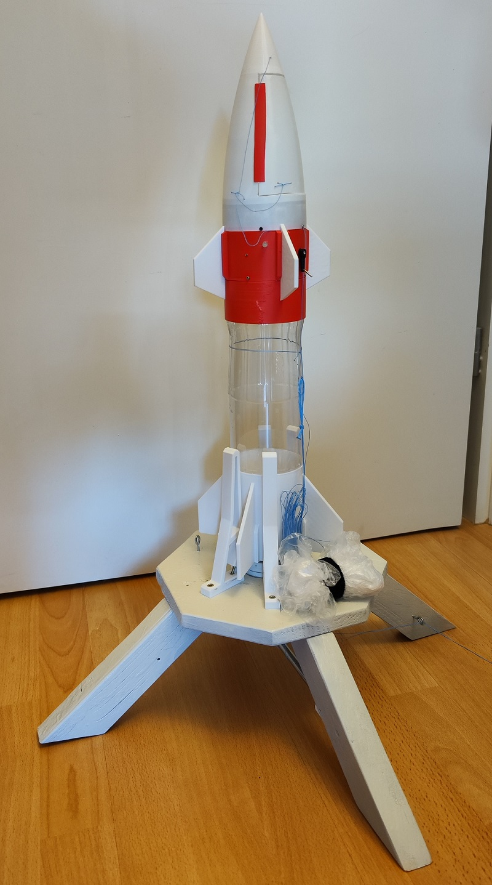
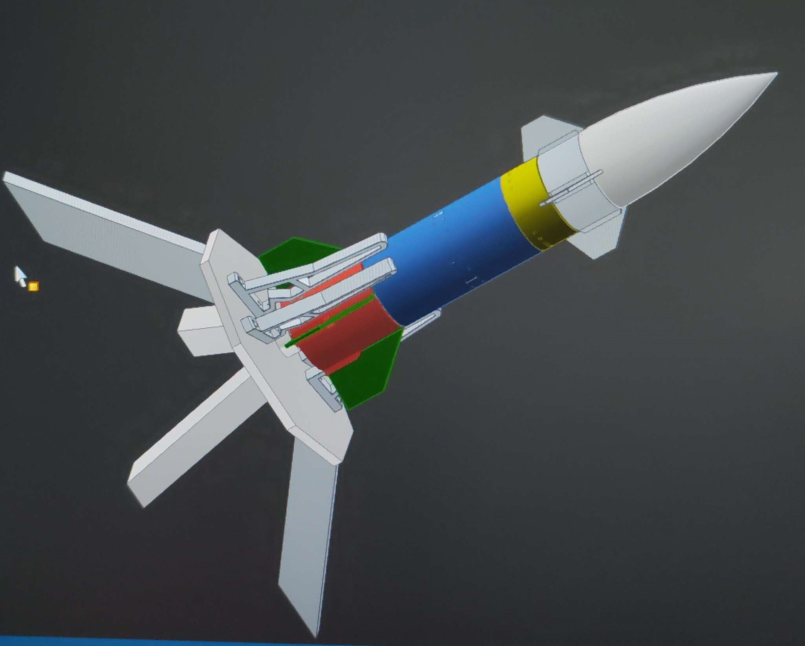

## 1. overview
The Water.Rocket is a 3D printed project. You will need:
- a 3D printer
- some Filaments
- empty Water Bottle (small)
- empty Water Bottle (hard plastic)
- some sealing rings
- car ventil
- some screws
- Wood (for the Rocket Base)
- NodeMCU
- 18260 Battery
- ADXL345
- neopixel LED
- servo
- wrapping wire
- plastic foil
- Cord
- superglue
- cable ties  
> **All together WITHOUT 3D printing, arround 40 $**

This the mp-remote commands for the NodeMCU board:  
- this windows console command upload the main.py to the micropython board over com6
`python.exe -m mpremote connect com6 cp main.py :`  
- this windows console command connects to the python prompt over com6  
`python.exe -m mpremote connect com6`  

## 2. water.rocket

Part list:
- great
- flight controller case
- 4x small fins
- bottle base top
- empty water bottle (hard plasatic PET)
- bottle base button
- 4x big fins  

Explosion view of the rocket:

so, the empty weight is 336 gramm (with flight-controller and 18650 battery)

## 3. flight controller
Parts:
- NodeMCU
- 18260 Battery
- on/off switch
- neopixel LED
- ADXL345
- Servo

Wiring-plan:

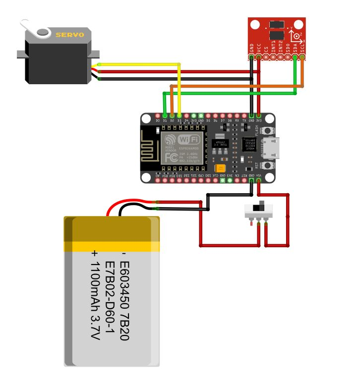  

Here are some photos from the finished controller:

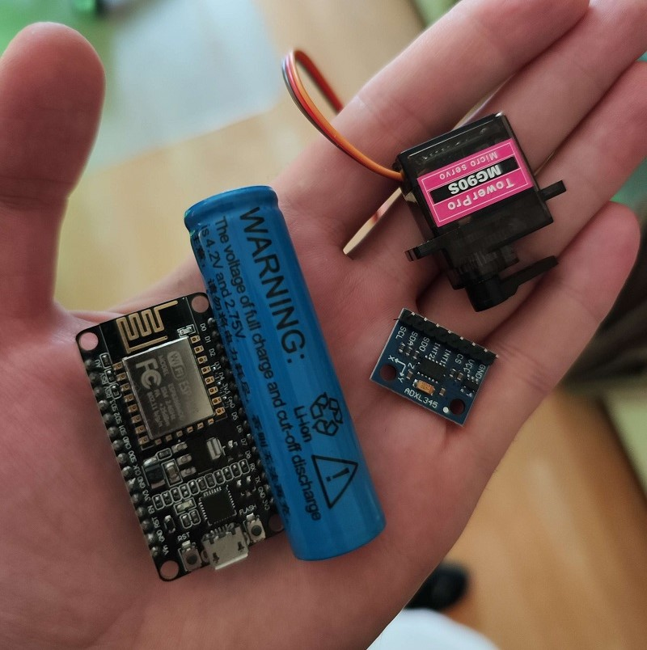  
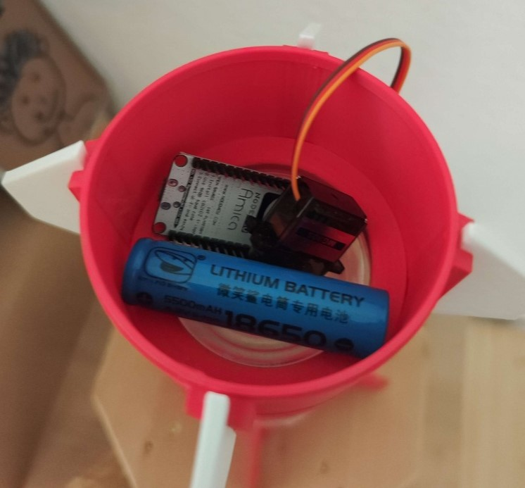  
  
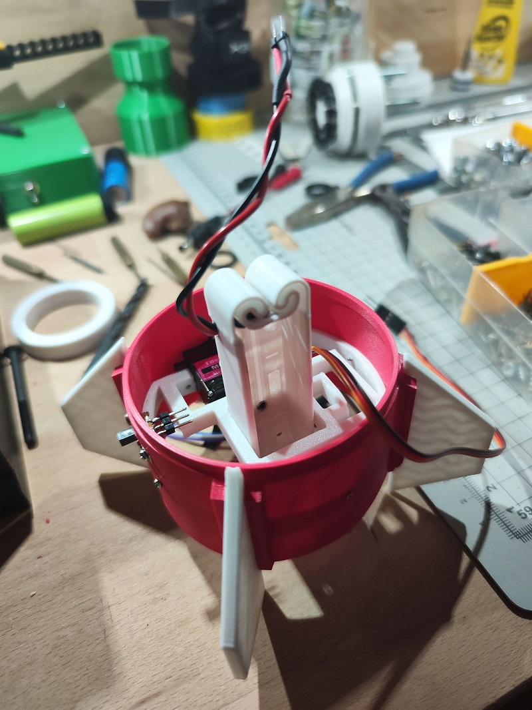  
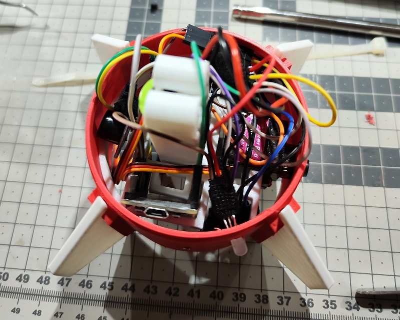  
  

## 4. software from flight controller

I coded the software in micropython. Main-programm is short (arround 20 lines), standard libraries for the neopixel and the adxl345.
The main function is the trigger for the parachute, when the ADXL345 is 0G, then the value go to arround -10. So i code the process, that at value 0 the servo go from 0° to 180°. The servo opens the door of the great and release the parachute over a spring mechanismus.
Here is the LINK to the code.

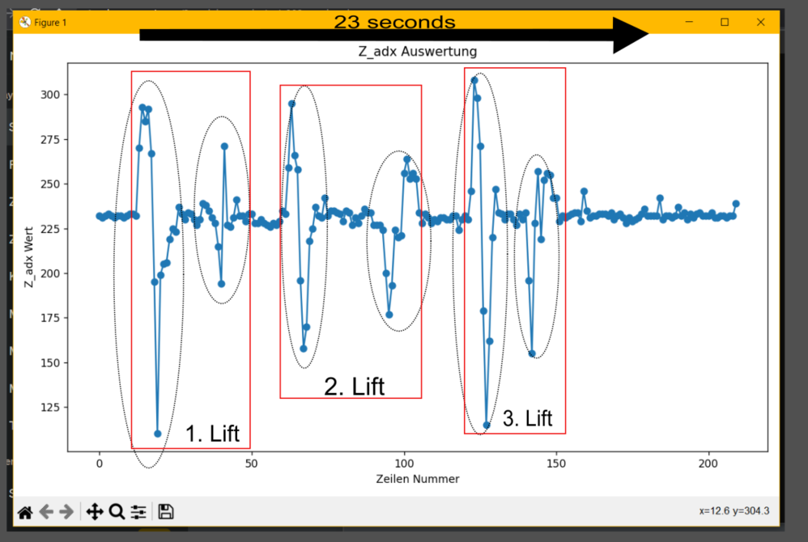

## 5. rocket.base
the rocket base is mixxed build from wood and 3d printing parts.
For put the pressed air in the bottle, i use a bicycle wheel value and some sealing rings.
The trigger is build from 3D printed, wrapping wiring and cable ties.
Parts:
- 4x support
- trigger ring on the top
- 16x cables ties
- ring outside for holding the cable ties
- ring inside for holding the cable ties
- plug
- 2x sealing rubber
- 6x M5x50 screws
- 12x washers
- 6x M5 screw nuts

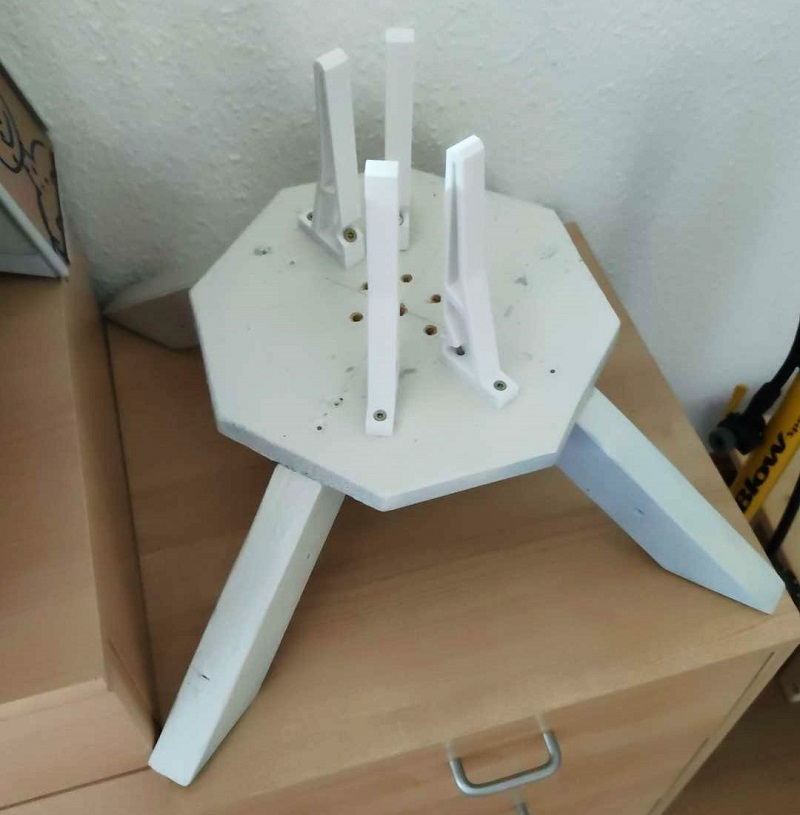
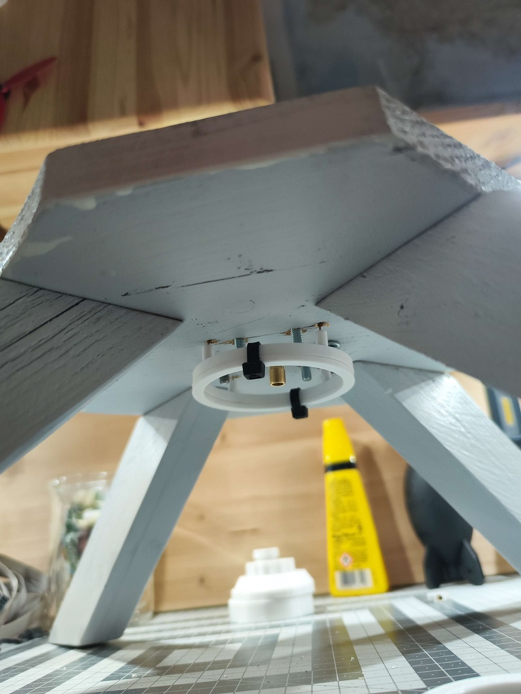
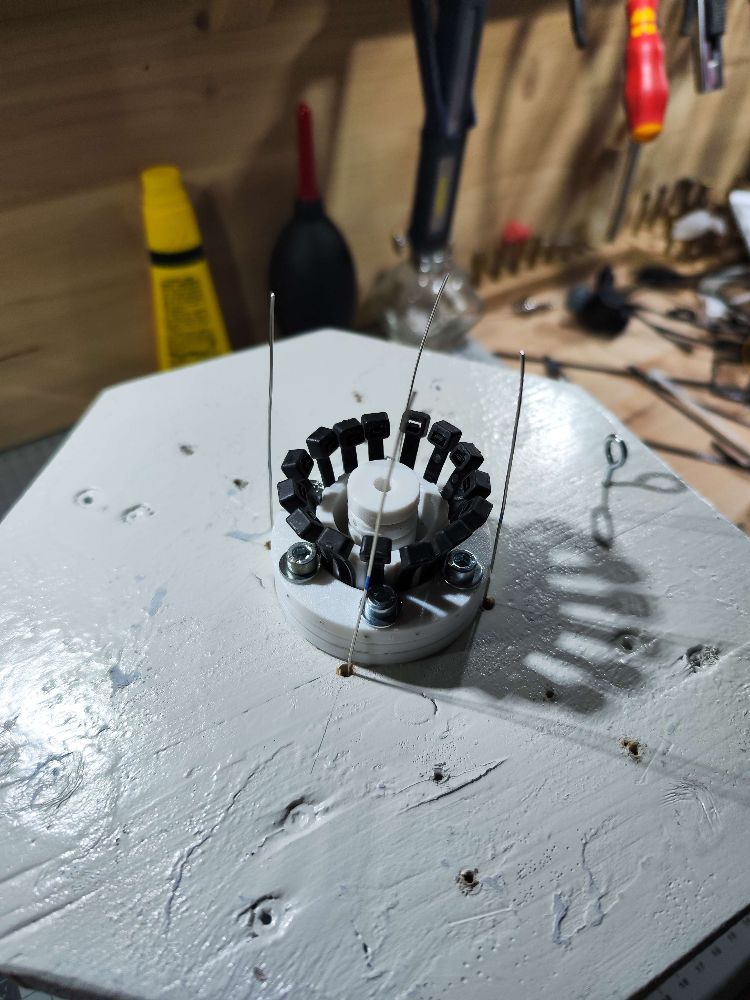

Explosion view of the rocket base:

## 6. trigger system  
here is the trigger system:
from the top
from the button
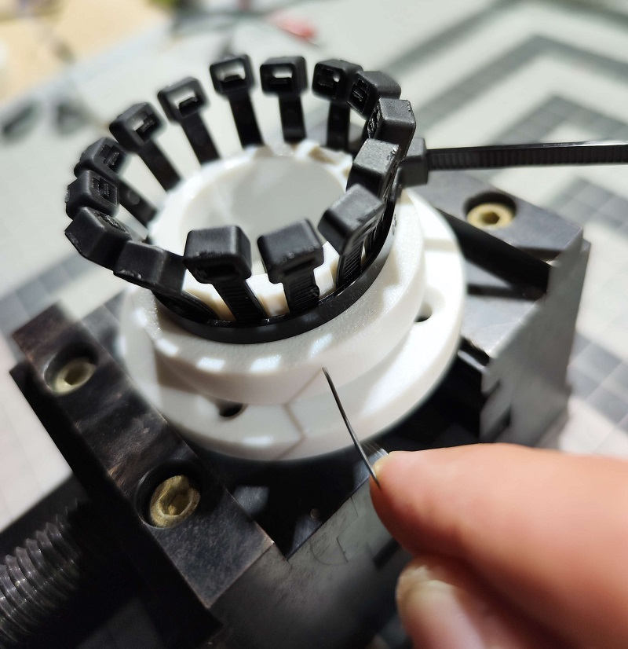
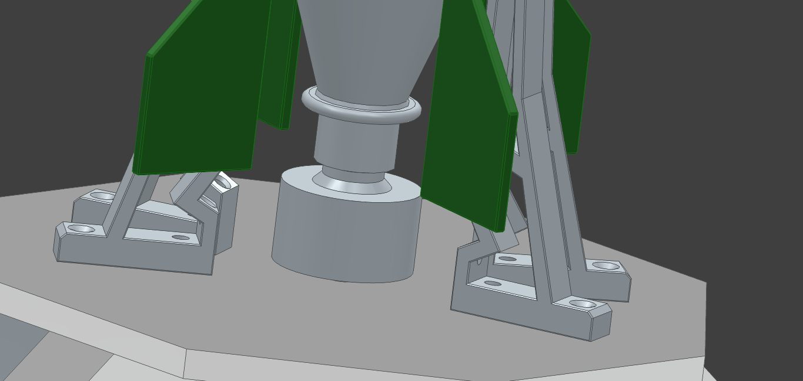
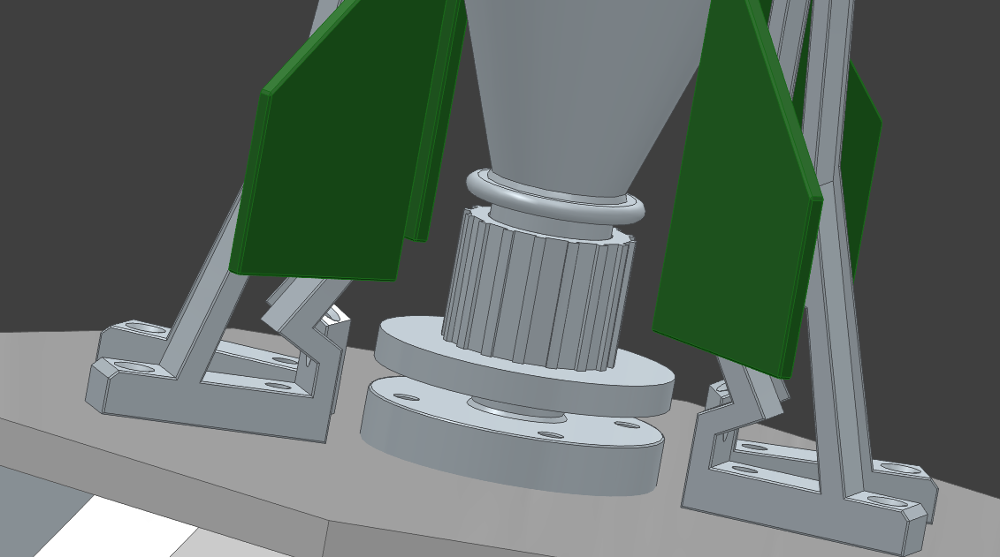

## 7. parachute system
the parachute is made from a plastic film.
Is important that the parachute is not much compact in the top. The parachute cord have to be oranisized in the top.

In the top i use a piece of a second plastic bottle as jumping spring. The parachute pressed against the spring. The great door pressed against the parachute. The cord from the top holding the door and can be triggered from the servo.

here are some photos and animations:

## 8. rocketscience and future builds  

so - at the end we can think about some questions:
what the economist way to shoot a rocket in sky?
what simple options are avaible?
how many different kind of rocket engines it haves?
