# Neptune 1 - Water Rocket 🚀

A 3D-printed water rocket with autonomous flight controller programmed in MicroPython. This project combines hardware engineering and embedded systems to create a fully functional model rocket powered by pressurized water and air.

**Vision:** Utilizing innovative water fuel for eco-friendly space propulsion research and education.

## Project Status

### Completed ✅
- 3D printed Body, Fins, and Rocket tip
- Parachute spring mechanism
- Flight controller assembly with NodeMCU, ADXL345 accelerometer, servo, and NeoPixel LED
- Rocket base with trigger system
- MicroPython flight control software
- Sensor data logging system

### In Progress / To-Do 📋
- Parachute door refinement
- Advanced parachute trigger system
- Flight Controller Software optimization
- Rocket base improvements
- Air tube and valve revision
- Nozzle optimization
- CAD files and documentation
- First test flight

## Quick Start

### MicroPython Board Commands
Upload main.py to NodeMCU over COM6:
```bash
python.exe -m mpremote connect com6 cp main.py :
```

Connect to Python REPL:
```bash
python.exe -m mpremote connect com6
```

## Table of Contents
- [1. Overview](#1-overview)
- [2. Water Rocket Structure](#2-water-rocket-structure)
- [3. Flight Controller](#3-flight-controller)
- [4. Flight Controller Software](#4-flight-controller-software)
- [5. Rocket Base](#5-rocket-base)
- [6. Trigger System](#6-trigger-system)
- [7. Parachute System](#7-parachute-system)
- [8. Rocket Science & Future](#8-rocket-science--future-builds)

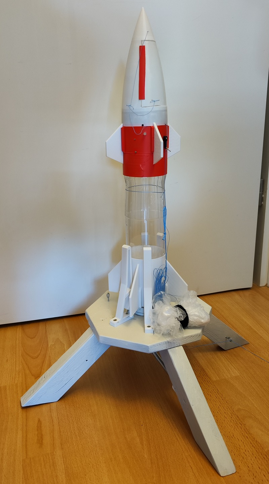
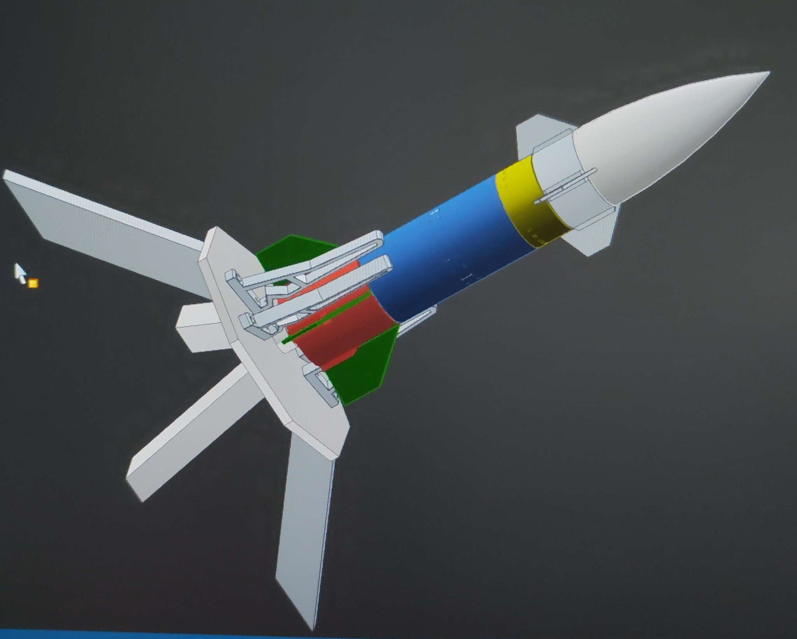


## 1. Overview

Neptune 1 is a complete water rocket system combining 3D printing, embedded systems, and aeronautical engineering.

### Components Needed

**Hardware (≈ $40 excluding 3D printing costs):**
- Empty plastic water bottles (1 small, 1 hard plastic PET)
- Bicycle wheel valve (for pressurization)
- Sealing rings and O-rings
- Wood (for rocket base/launch platform)
- Hardware: M5 screws (6x), washers (12x), nuts (6x), cable ties
- Wrapping wire and superglue

**Electronics:**
- NodeMCU microcontroller
- 18650 Li-Ion battery
- ADXL345 3-axis accelerometer (I2C)
- Servo motor (for parachute deployment)
- WS2812 NeoPixel LED (status indicator)
- On/off switch

**Fabrication:**
- 3D printer with filament
- Standard hand tools  


## 2. Water Rocket Structure

The main rocket body is constructed from a standard 1.5L hard plastic PET water bottle, reinforced with 3D-printed components.

### 3D Printed Parts
- **Nose cone** (aerodynamic tip)
- **Flight controller case** (waterproof enclosure)
- **4x small stabilizing fins**
- **4x large fins** (provides stability and rotation)
- **Bottle base adapter** (connects bottle to launch platform)
- **Bottle base button** (release mechanism)

### Specifications
- **Empty Weight:** 336g (including flight controller + 18650 battery)
- **Propellant:** Water (typical fill: 0.5-1.5L)
- **Pressurization:** Compressed air (typically 4-8 bar)  


## 3. Flight Controller

Autonomous electronics system that monitors flight conditions and deploys the parachute.

### Components
| Component | Purpose |
|-----------|---------|
| **NodeMCU ESP8266** | Main microcontroller |
| **ADXL345 Accelerometer** | Detects 0G condition (apogee) |
| **Servo Motor** | Triggers parachute deployment |
| **WS2812 NeoPixel LED** | Status indicator (red = active, green = ready) |
| **18650 Li-Ion Battery** | Power supply (~1000mAh for ~1 hour operation) |
| **On/Off Switch** | Manual power control |
| **I2C Bus** | Communication: NodeMCU ↔ ADXL345 |

### GPIO Mapping
- **GPIO 13:** NeoPixel LED
- **GPIO 14:** Servo PWM signal
- **GPIO 12:** Buzzer (optional feedback)
- **GPIO 4/5:** I2C SDA/SCL (ADXL345)

### Wiring Diagram
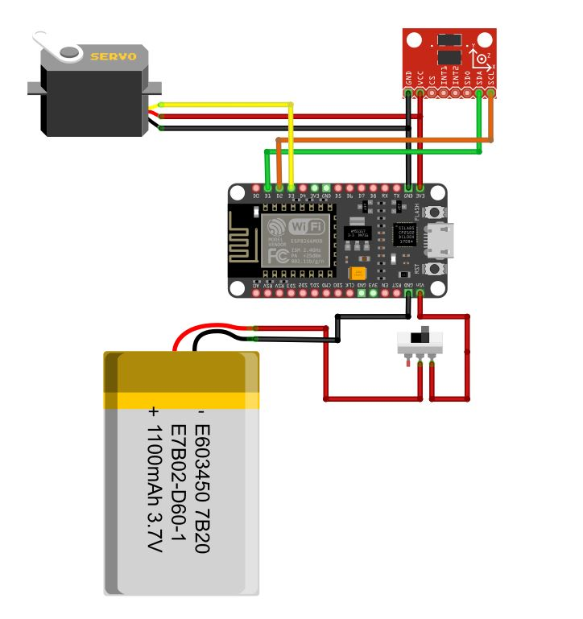

### Assembly Photos
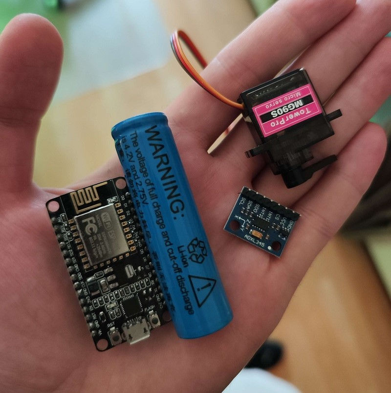
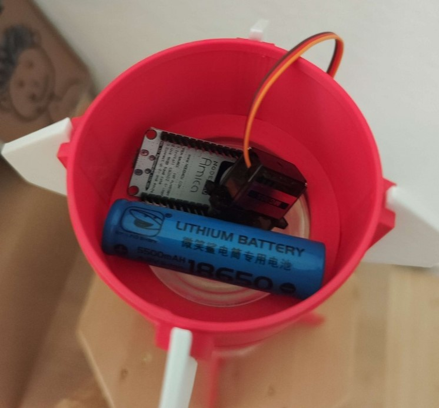
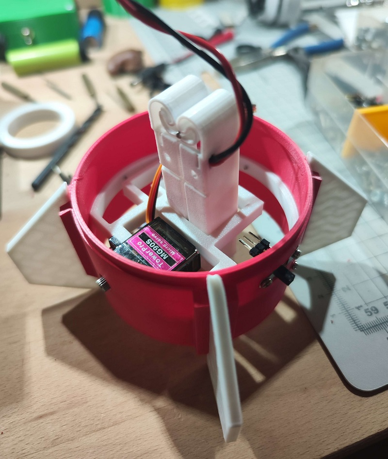
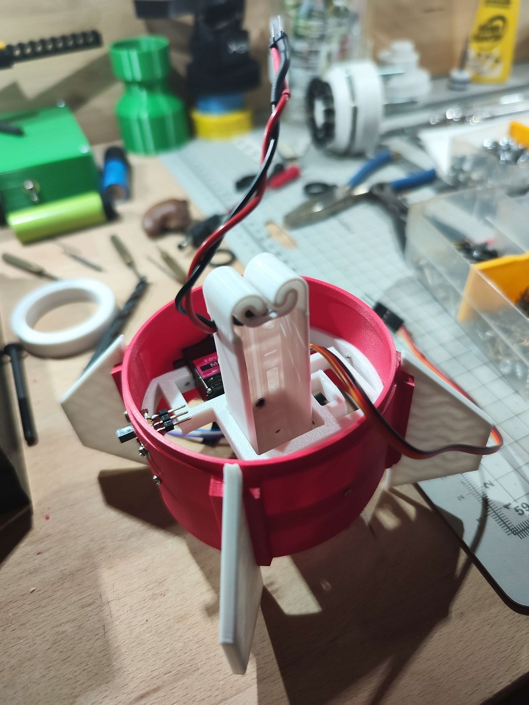
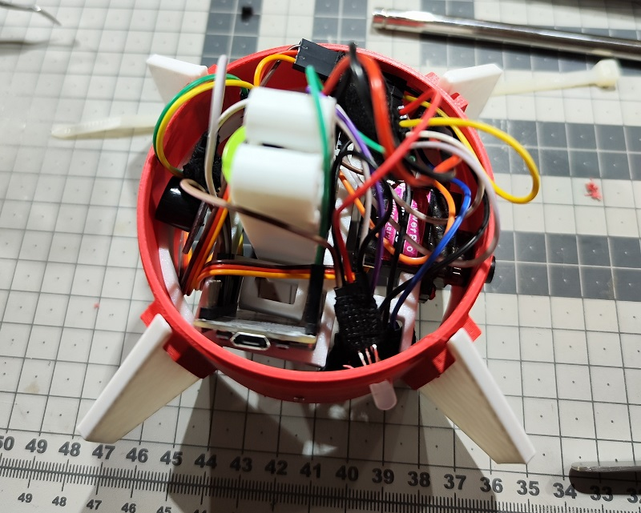
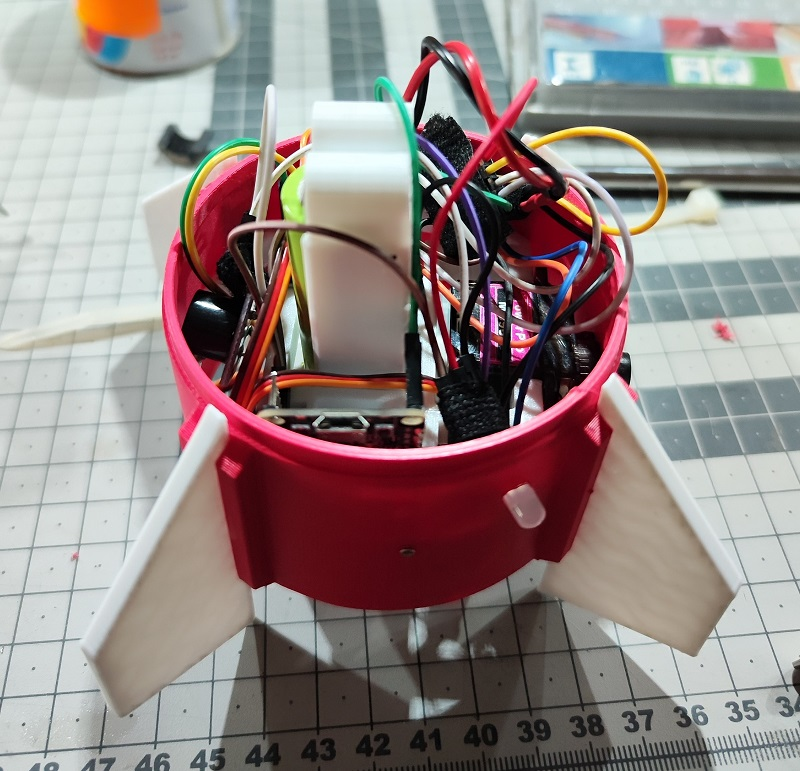  


## 4. Flight Controller Software

The firmware runs on MicroPython and implements real-time monitoring and autonomous parachute deployment.

### Architecture

**Main Tasks (Async/Concurrent):**
1. **sensordata()** - Logs accelerometer data to `sensor.txt`
2. **buzzer()** - Audible feedback when apogee detected
3. **servo()** - Deploys parachute when 0G detected

### Algorithm

The deployment trigger works by detecting weightlessness:

```
Z-axis acceleration value progression:
↑ 200+     Launch phase (accelerating upward)
↑ 100-150  Powered flight
↑ 0-50     Coasting upward  
→ -10 to 0 Apogee (0G, weightless) ← TRIGGER
↓ 0-50     Falling
↓ 100+     Descent under parachute
```

**Deployment Sequence:**
1. Sensor detects Z-axis ≈ 0 (±10)
2. Buzzer sounds for 0.5s
3. Servo commanded: 30° → 122° (0.3s motion)
4. Parachute door opens, spring releases parachute

### Performance Data
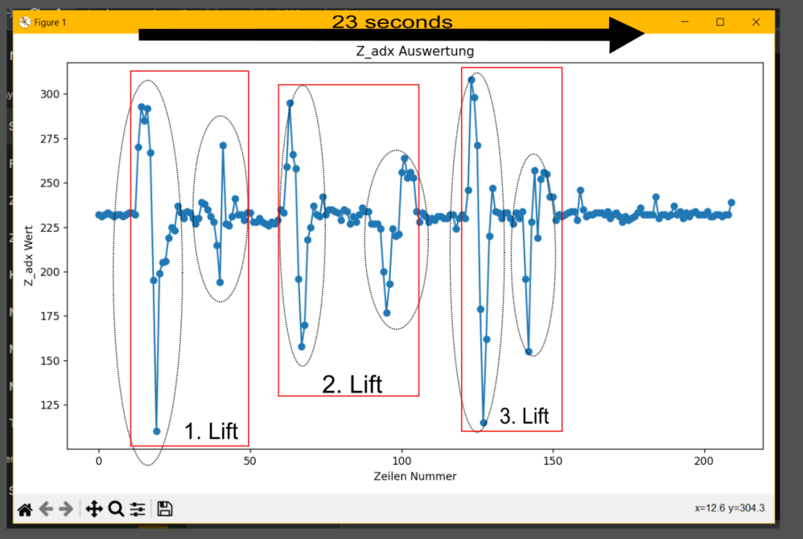

*Graph shows typical flight profile: rapid acceleration at launch, coast phase, and detection moment at apogee.*

### Key Code Details
- **I2C Interface:** 400kHz frequency, addresses 0x53 (ADXL345)
- **Sampling:** Continuous polling, recorded with HH:MM:SS.mmm timestamps
- **Servo Control:** PWM duty cycle 30-122 for full range motion
- **Detection Threshold:** `abs(z_value) < 10` indicates 0G condition


## 5. Rocket Base (Launch Platform)

Hybrid construction combining wood support structure with 3D-printed mechanical components. Designed for safe pressurization and reliable launch.

### Components

**Structural (Wood):**
- Base platform (supports vehicle weight during pressurization)
- Stable tripod/stand design

**3D Printed:**
- 4x support legs
- Trigger ring (top retention)
- Cable tie ring (outer)
- Cable tie guide (inner)
- Valve plug adapter
- 2x sealing rubber inserts

**Hardware:**
- 6x M5×50 bolts
- 12x M5 washers
- 6x M5 lock nuts
- 16x cable ties (holds bottle during pressurization)
- Bicycle wheel valve (Schrader type, for pressurization)

### Pressurization System

1. Bicycle wheel valve screwed into bottle base
2. Sealing rings prevent air leakage
3. Air pump pressurizes to 4-8 bar
4. Cable ties prevent bottle rupture
5. Trigger mechanism holds bottle at launch platform

### Assembly Photos
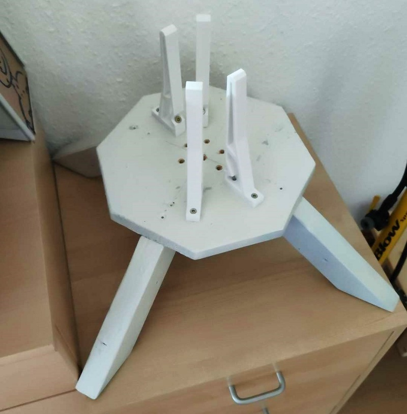
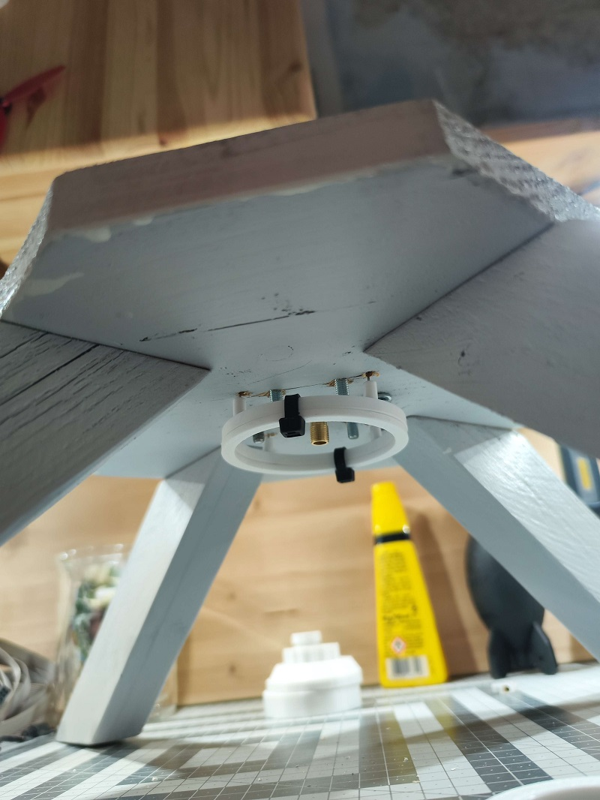
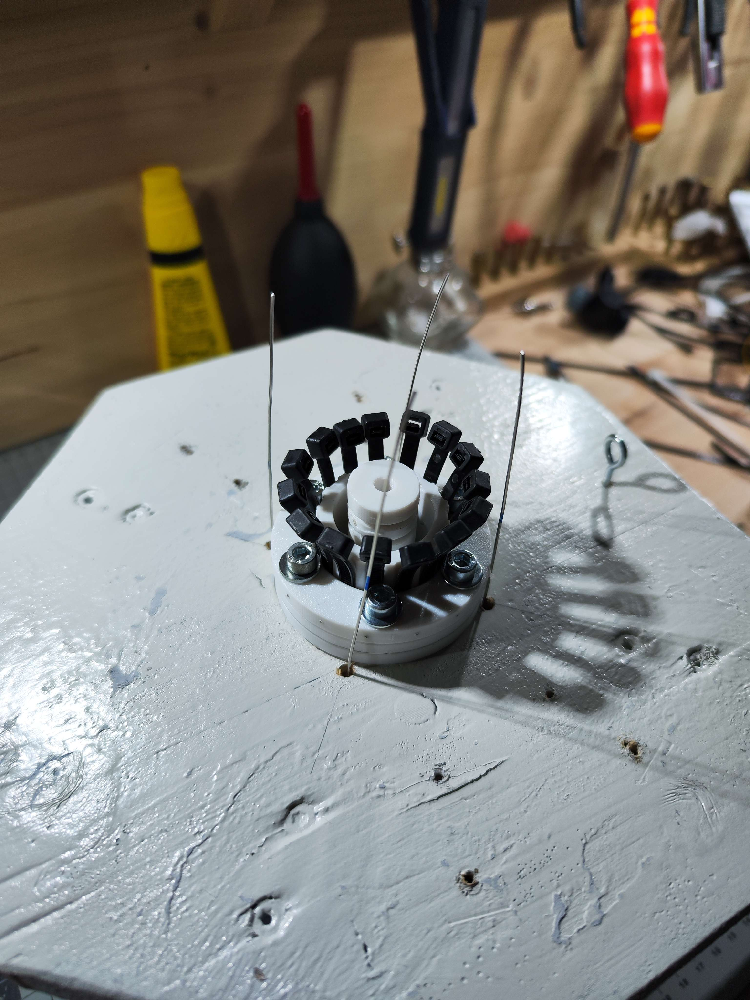

### Explosion View
*CAD models showing component assembly order (to be added)*


## 6. Trigger System

Mechanical release mechanism holds the rocket in place during pressurization and releases it instantly on command.

### Mechanism
- **Cable tie system:** Multiple cable ties wrap around bottle
- **Trigger ring:** Holds cable ties under tension
- **Manual release:** Pulling trigger ring withdraws cable ties
- **Instant launch:** Bottle released from platform with full thrust

### Design Philosophy
- **Fail-safe:** Mechanical (no electronics required for launch)
- **Reliable:** Cable ties proven in multiple tests
- **Quick-release:** Friction-free instantaneous separation
- **Safe:** Operator maintains control until ready

### Photos
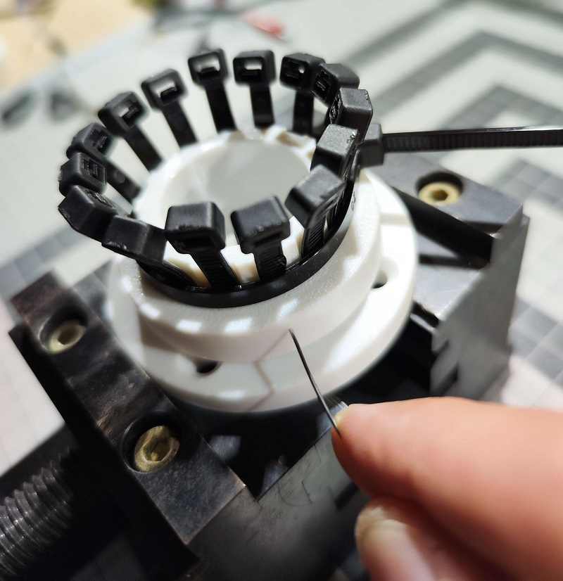

### CAD Views
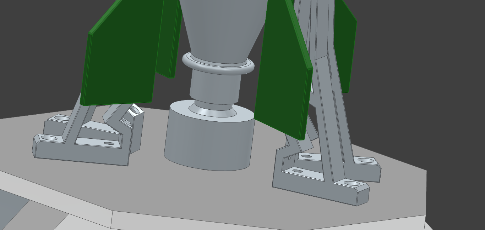
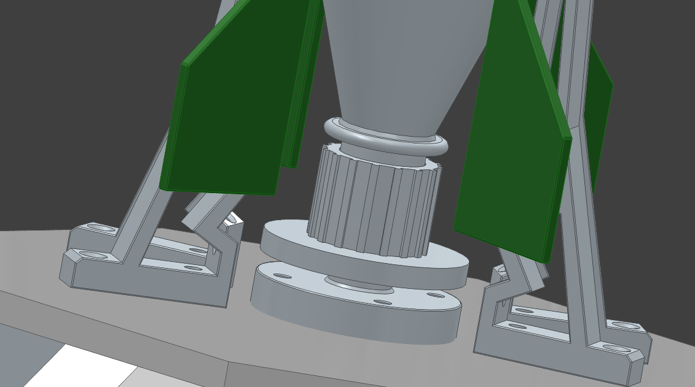


## 7. Parachute System

Recovery system deploys automatically at apogee to safely return the rocket.

### Design

**Parachute Construction:**
- Material: Thin plastic film (similar to plastic bag material)
- Diameter: ~0.5m nominal when deployed
- Attachment: Cord tied to rocket nose cone

**Deployment Mechanism:**
- **Spring:** Piece of plastic bottle acts as compression spring
- **Door:** 3D-printed nose cone door holds parachute compressed
- **Trigger:** Servo-activated cord release
- **Sequence:** Spring pushes parachute out once door opens

### Key Design Principle
*Loose packing is critical:* The parachute must not be tightly folded to ensure:
1. Reliable deployment (avoids tangles)
2. Proper billowing (full drag surface)
3. Soft opening (reduces shock loads)

### Deployment Sequence
1. **Apogee detected** by accelerometer (0G)
2. **Servo energized** → 30° to 122° rotation (0.3s)
3. **Cord pulled** → door mechanism releases
4. **Spring expands** → pushes parachute out
5. **Parachute inflates** → slows descent to ~5-8 m/s

### Recovery Video
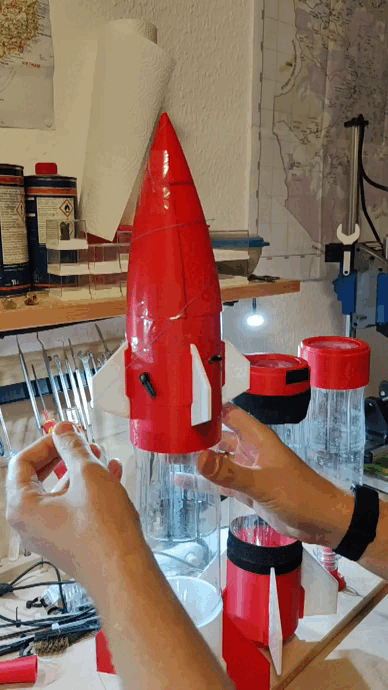


## 8. Rocket Science & Future Builds

### Physics & Performance

**Launch Parameters:**
- **Propellant mass:** Water (typically 500-1500g)
- **Propellant pressure:** 4-8 bar (relative)
- **Launch acceleration:** ~20-30G typical
- **Apogee:** 50-100m typical (depending on water fill)
- **Flight time:** 8-15 seconds total

**Recovery:**
- **Descent rate:** ~6-8 m/s under parachute
- **Impact energy:** Low (safe for electronics recovery)
- **Reusability:** Can fly multiple times (refill water)

### Questions for Optimization

1. **Efficiency:** What is the most economical water/pressure ratio?
2. **Propulsion Options:** 
   - Pure water + compressed air (current)
   - Two-phase mixture?
   - Alternative propellants?
3. **Engine Design Variants:**
   - Different nozzle geometries
   - Variable pressure profiles
   - Multi-stage designs?

### Future Improvements

**Planned Enhancements:**
- [ ] Advanced sensor suite (pressure, temperature, altitude)
- [ ] Telemetry transmission (wireless flight data)
- [ ] Multiple parachute stages
- [ ] Modular nose cone designs
- [ ] Performance optimization through CFD
- [ ] Educational documentation & building guides

**Research Directions:**
- Thermodynamic efficiency analysis
- Optimal parachute sizing
- Structural optimization for higher pressures
- Autonomous flight path tracking

### Education & Outreach

This project demonstrates:
- Applied physics (mechanics, thermodynamics)
- Embedded systems (real-time control)
- Materials engineering (3D printing optimization)
- Systems integration (mechanical + electrical)

**Ideal for:** STEM education, engineering competitions, maker communities
