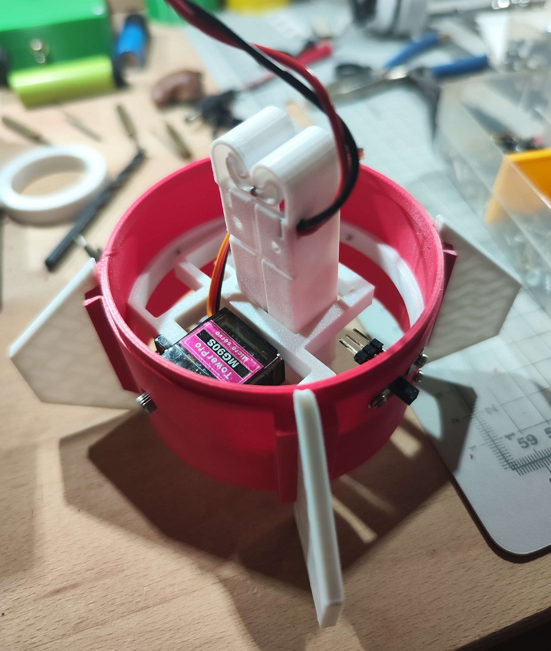
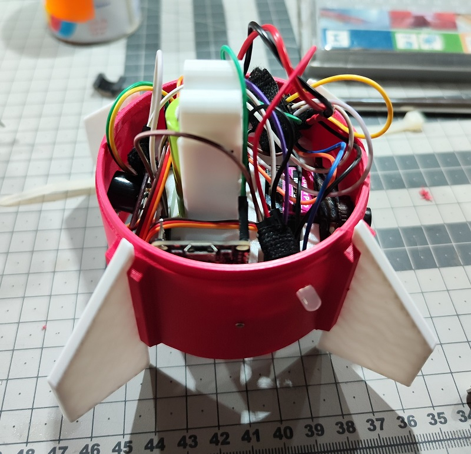
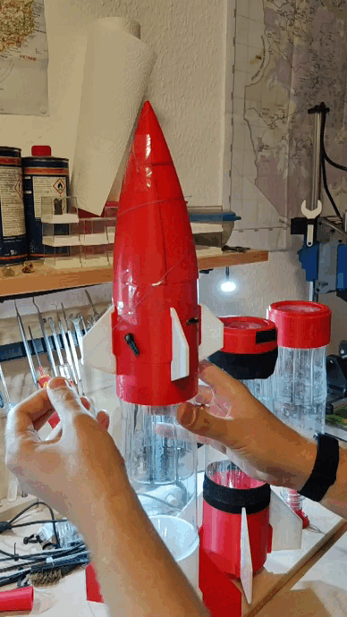

# Neptune 1 - is a Water.Rocket 3D printed and programmed in Micropython  
3D print:
  - [x] 3D printed Body 
  - [x] 3D printed Fins
  - [x] 3D printed Rocket tip  
Parachute:
  - [x] Parachute spring
  - [ ] Parachute door
  - [ ] Parachute trigger  
Improves:
  - [ ] improve Flight Controller Software
  - [ ] improve rocket base (plastic)
  - [ ] imporve Air tube + valve revise
  - [ ] improve nozzle  
CAD:  
   - [ ] add CAD files to the github repo
   - [ ] CAD building plan
   - [ ] CAD explosion view  
Testing:
  - [ ] first test flight

## -> Utilizing innovative water fuel for eco-friendly space propulsion  
## Requirements specification:
- [Neptune 1 - is a Water.Rocket 3D printed and written in Micropython](#neptune-1---is-a-waterrocket-3d-printed-and-written-in-micropython)  
   uses inovated water fuel for eco-friendly space boosts
  - [Requirements specification:](#requirements-specification)
  - [1. overview](#1-overview)
  - [2. water.rocket](#2-waterrocket)
  - [3. flight controller](#3-flight-controller)
  - [4. software from flight controller](#4-software-from-flight-controller)
  - [5. rocket.base](#5-rocketbase)
  - [6. trigger system](#6-trigger-system)
  - [7. parachute system](#7-parachute-system)
  - [8. rocketscience and future builds](#8-rocketscience-and-future-builds)

## 1. overview
The Water.Rocket is a 3D printed project. You will need:
- a 3D printer
- some Filaments
- empty Water Bottle (small)
- empty Water Bottle (hard plastic)
- some sealing rings
- car valve
- some screws
- Wood (for the Rocket Base)
- NodeMCU
- 18260 Battery
- ADXL345
- neopixel LED
- servo
- wrapping wire
- plastic foil
- cord
- superglue
- cable ties  
> **All together WITHOUT 3D printing, arround 40 $**

This the mp-remote commands for the NodeMCU board:  
- this windows console command uploads the main.py to the micropython board over com6  
`python.exe -m mpremote connect com6 cp main.py :`  
- this windows console command connects to the python prompt over com6  
`python.exe -m mpremote connect com6`  

## 2. water.rocket

Part list:
- great
- flight controller case
- 4x small fins
- bottle base top
- empty water bottle (hard plasatic PET)
- bottle base button
- 4x big fins  

Explosion view of the rocket:  

so, the empty weight is 336 gramm (with flight-controller and 18650 battery)  

## 3. flight controller
Parts:
- NodeMCU
- 18260 Battery
- on/off switch
- neopixel LED
- ADXL345
- Servo

Wiring-plan:

  

Here are some photos from the finished controller:

  
  
  
  
  
  

## 4. software from flight controller

The software is written in MicroPython. The main program is short (around 20 lines) with standard libraries for the neopixel and the ADXL345.  
The main function triggers the parachute when the ADXL345 detects 0G, which corresponds to a value of around -10.  
When the value reaches 0, the servo moves from 0° to 180°, opening the door of the Great and releasing the parachute via a spring mechanism.  

## 5. rocket.base
The rocket base is a mixed construction of wood and 3D printed parts.  
To pressurize the air in the bottle, a bicycle wheel valve and some sealing rings are used.  
The trigger is constructed from 3D printed parts, wrapping wire, and cable ties.  
Parts:
- 4x support
- trigger ring on the top
- 16x cables ties
- ring outside for holding the cable ties
- ring inside for holding the cable ties
- plug
- 2x sealing rubber
- 6x M5x50 screws
- 12x washers
- 6x M5 screw nuts

Explosion view of the rocket base:

## 6. trigger system  
here is the trigger system:
from the top
from the button

## 7. parachute system  
The parachute is made from a plastic film.  
It's important that the parachute is not tightly packed at the top. The parachute cord should be organized at the top.  

At the top, a piece of a second plastic bottle is used as a jumping spring.  
The parachute is pressed against the spring, and the Great door is pressed against the parachute.  
The cord from the top holds the door and can be triggered by the servo.  

here are some photos and animations:  

## 8. rocketscience and future builds  

so - at the end we can think about some questions:
what the economist way to shoot a rocket in sky?
what simple options are avaible?
how many different kind of rocket engines it haves?
